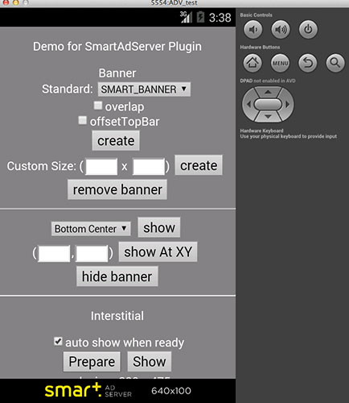
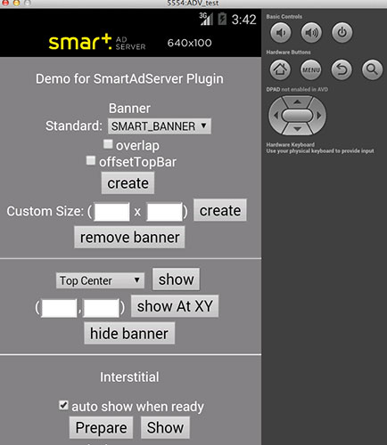
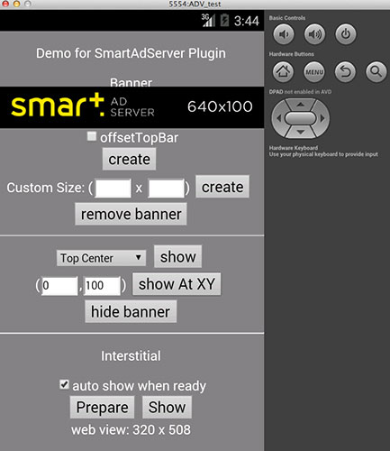
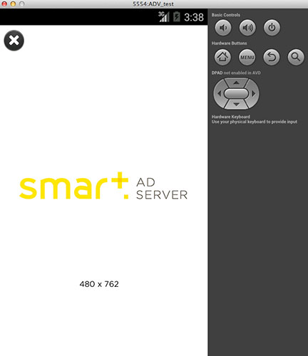

# cordova-smart-adserver

Cordova/PhoneGap Plugin for [Smart Ad Server](http://smartadserver.com/).

### Show Mobile Ad with single line of javascript code ###

Step 1: Prepare SiteId, PageId, FormatId, and baseUrl, in [Smart Ad Server portal](http://manage.smartadserver.com/), then write it in your javascript code.

```javascript
	var ad_units = {};
	if( /(android)/i.test(navigator.userAgent) ) { 
		ad_units = { // for Android
            siteId: 73569,
			banner: '549527/15140',  // in pattern: '{pageId}/{formatId}'
			interstitial: '549527/12145'
		};
	} else if(/(ipod|iphone|ipad)/i.test(navigator.userAgent)) {
		ad_units = { // for iOS
            siteId: 73568,
			banner: '549526/15140',
			interstitial: '549526/12145'
		};
	} else {
		alert('Windows phone not supported');
	}
    var defaultOptions = {
        siteId: ad_units.siteId,
        baseUrl: 'http://mobile.smartadserver.com',
        position: SmartAdServer.AD_POSITION.BOTTOM_CENTER,
        // offsetTopBar: false, // avoid overlapped by status bar, for iOS7+
        bgColor: 'black', // color name, or '#RRGGBB'
        isTesting: true, // set to true, to receiving test ad for testing purpose
        // autoShow: true // auto show interstitial ad when loaded, set to false if prepare/show
    };
    SmartAdServer.setOptions( defaultOptions );

```

Step 2: Want a banner? single line of javascript code.

```javascript
// it will display smart banner at top center, using the default options
if(SmartAdServer) SmartAdServer.createBanner( {
	adId: ad_units.banner, 
	position: SmartAdServer.AD_POSITION.TOP_CENTER, 
	autoShow: true 
} );
```

Step 3: Want full screen Ad? Easy. 

```javascript
// load and display full screen Ad
if(SmartAdServer) SmartAdServer.prepareInterstitial( {
	adId: ad_units.interstitial, 
	autoShow: true
} );
```

### Features ###

Platforms supported:
- [x] Android
- [x] iOS

Highlights:
- [x] Easy-to-use: Display Ad with single line of javascript code.
- [x] Powerful: Support banner, interstitial.
- [x] Smart: Auto fit on orientation change.
- [x] Same API: Exactly same API with other RjFun Ad plugins, easy to switch from one Ad service to another.

## How to use? ##

* If use with Cordova CLI:
```bash
cordova plugin add com.chunk.cordova.smartadserver
```

* If use with PhoneGap Buid, just configure in config.xml:
```javascript
<gap:plugin name="com.chunk.cordova.smartadserver" source="plugins.cordova.io"/>
```

* If use with Intel XDK:
Project -> CORDOVA 3.X HYBRID MOBILE APP SETTINGS -> PLUGINS AND PERMISSIONS -> Third-Party Plugins ->
Add a Third-Party Plugin -> Get Plugin from the Web, input:
```
Name: AdMobPluginPro
Plugin ID: com.chunk.cordova.smartadserver
[x] Plugin is located in the Apache Cordova Plugins Registry
```

## Quick start with cordova CLI ##
```bash
	# create a demo project
    cordova create test1 com.chunk.test1 Test1
    cd test1
    cordova platform add android

    # now add the plugin, cordova CLI will handle dependency automatically
    cordova plugin add com.chunk.cordova.smartadserver

    # now remove the default www content, copy the demo html file to www
    rm -r www/*;
    cp plugins/com.chunk.cordova.smartadserver/test/* www/;

	# now build and run the demo in your device or emulator
    cordova prepare; 
    cordova run android; 
    # or import into eclipse
```

## Javascript API Overview ##

Methods:
```javascript
// use banner
createBanner(adId/options, success, fail);
removeBanner();
showBanner(position);
showBannerAtXY(x, y);
hideBanner();

// use interstitial
prepareInterstitial(adId/options, success, fail);
showInterstitial();

// set default value for other methods
setOptions(options, success, fail);
```

## Screenshots ##

Banner Bottom | Banner Top
-------|----------
 | 
Banner Toast | Interstitial
 | 

## Credits ##

This Cordova plugin is developed by Raymond Xie for Groupe Express-Roularta and Chunk Group.

[Groupe Express-Roularta](http://www.lexpress.fr/) is the sponsor of Android code of this project, and agrees to publish as open source to benefit the community.

[Chunk](http://www.chunkgroup.com/) is the sponsor of iOS code of this project, and agrees to publish as open source to benefit the community.

## See Also ##

Ad PluginPro series for the world leading Mobile Ad services:

* [GoogleAds PluginPro](https://github.com/floatinghotpot/cordova-admob-pro), for Google AdMob/DoubleClick.
* [iAd PluginPro](https://github.com/floatinghotpot/cordova-iad-pro), for Apple iAd. 
* [FacebookAds PluginPro](https://github.com/floatinghotpot/cordova-plugin-facebookads), for Facebook Audience Network.
* [FlurryAds PluginPro](https://github.com/floatinghotpot/cordova-plugin-flurry), for Flurry Ads.
* [mMedia PluginPro](https://github.com/floatinghotpot/cordova-plugin-mmedia), for Millennial Meida.
* [MobFox PluginPro](https://github.com/floatinghotpot/cordova-mobfox-pro), for MobFox.
* [MoPub PluginPro](https://github.com/floatinghotpot/cordova-plugin-mopub), for MoPub.

More Cordova/PhoneGap plugins by Raymond Xie, [find them in plugin registry](http://plugins.cordova.io/#/search?search=rjfun).

If use in commercial project and need email/skype support, please [buy a license](http://rjfun.github.io/), you will be supported with high priority.

Project outsourcing and consulting service is also available. Please [contact us](mailto:rjfun.mobile@gmail.com) if you have the business needs.

